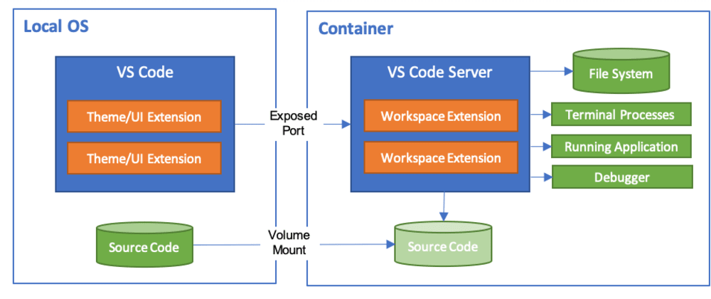

# Internal Sessions. Using MAPS-Analytics docker image

Recently, our MAPS-Analytics team released their own docker [image ](https://hub.docker.com/r/mapsanalyticsmetrics/databricks-ml). This image ships with the python libraries used by Databricks-ML, to make the python code compatible between cloud- and local-based projects.

This tutorial shows how to set-up Visual Studio Code to increase our productivity working with python code.

## What is Docker?

### Not a Virtual Machine

On the high-level, a running docker container looks a lot like a virtual machine, but it is not a virtual machine. As displayed in the following chart, docker containers share the kernel of the host operating system. 

### Build Layers

To increase performance, the Docker Engine uses layers. For instance, we may have two docker images based on Ubuntu and Elasticsearch, that share common layers. This saves space but it is also efficient when re-building images.

### Compose

Docker-compose helps us manage different docker containers (services) that should run at the same time and be able to communicate with each other. It is particularly useful when each container has a very specific task that may depend on other containers, but can be engineered as an independent service.

Although this is very interesting, we do not have to worry about the low level functioning of Docker to be able to exploit it in our daily work.

## How to setup python in VSCode + docker

To use the python binary that ships with our custom docker image databricks-ml, 
we need several ingredients.

1. A Dockerfile with build steps for our final image
2. A docker-compose.yml
3. Our python code
4. Remote Containers VSCode Extension (ms-vscode-remote.remote-containers)

When using the Remote Extensions in vscode, by default our project root folder is mounted in the `/workspaces` folder of the container we want to connect to.

### Hands-on

We can start with a base folder template that can be found [here](https://github.com/juancarloslaria-tomtom/docker-vscode-python).