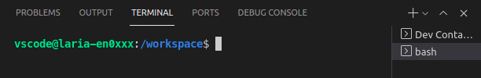
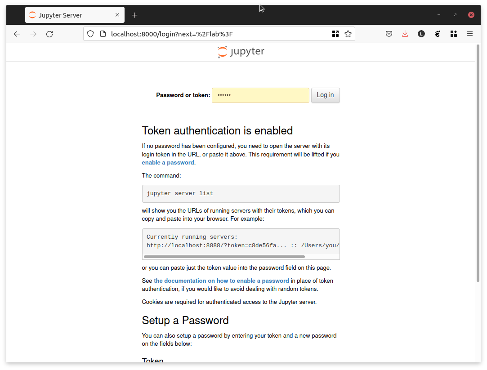

# Internal Sessions. Using MAPS-Analytics docker image

Recently, our MAPS-Analytics team released their own docker [image ](https://hub.docker.com/r/mapsanalyticsmetrics/databricks-ml). This image ships with the python libraries used by Databricks-ML, to make the python code compatible between cloud- and local-based projects.

This tutorial shows how to set-up Visual Studio Code to increase our productivity working with python code.

## What is Docker?

### Not a Virtual Machine

On the high-level, a running docker container looks a lot like a virtual machine, but it is not a virtual machine. As displayed in the following chart, docker containers share the kernel of the host operating system. 

### Build Layers

To increase performance, the Docker Engine uses layers. For instance, we may have two docker images based on Ubuntu and Elasticsearch, that share common layers. This saves space but it is also efficient when re-building images.

### Compose

Docker-compose helps us manage different docker containers (services) that should run at the same time and be able to communicate with each other. It is particularly useful when each container has a very specific task that may depend on other containers, but can be engineered as an independent service.

Although this is very interesting, we do not have to worry about the low level functioning of Docker to be able to exploit it in our daily work.

## How to setup python in VSCode + docker

To use the python binary that ships with our custom docker image databricks-ml, 
we need several ingredients.

1. A Dockerfile with build steps for our final image
2. A docker-compose.yml
3. Our python code
4. Remote Containers VSCode Extension (ms-vscode-remote.remote-containers)

When using the Remote Extensions in vscode, by default our project root folder is mounted in the `/workspaces` folder of the container we want to connect to.

### Step-by-step guide

We can start with a base folder template that can be found [here](https://github.com/juancarloslaria-tomtom/docker-vscode-python).

Clone the reopsitory in your preferred local path.

Then, open the cloned folder in vscode, and click the bottom-left green button to open the Remote Extensions options and select *Reopen in Container*.

We are now connected to the databricks-ml container.

If we open a new bash terminal under the `+` menu in the Terminal tab, we can see that the user is `vscode`, which means that the terminal is running inside the container.

We are now ready to start coding!

## Jupyter Lab 

Our Dockerfile (`environment/Dockerfile`) is customized with a Jupyter Lab installation. This means that, once the container is running, we can have access to Jupyter Lab from any web browser at http://localhost:8000.

The default password is `tomtom`.

We can find our project under the `/wokspace` folder.

Any changes that we make to this folder will reflect in our local project. Thus, we can safely work from inside the Jupyter Lab web interface.

### Notebooks

Jupyter notebooks are the best way to explore the capabilities of python, and begin writing code that later can be wrapped in a python script.

To create a new python notebook, navigate to the `notebooks` folder and go to *File/New/Notebook*.

Let's write some dummy code.

### Python Files

Now that we have tested our code in a notebook, we are ready to write the same code in a function to import later. First, we create a new txt file in *File/New/TextFile*, and then rename that file to something with `.py` extension, such as `mymodule.py`.

We can import our `welcome` function from any notebook in the same path.

### Python Executable Scripts

We can also create a python file that we can run from the terminal.

Jupyter Lab has its own terminal that we can use for the same purpose as the VSCode terminal that runs inside the container.

There, we can give `myscript.py` executable permissions and run it from the terminal.

## Visual Studio Code Editor

When working with python files, we can use VSCode to debug. In our example, we can set a breakpoint in line 11 of `mymodule.py`, and see what happens when we debug.

With the breakpoint set, open `myscript.py` and click *Run and Debug*. Select *Python file*.

After we input a name in the console, we see the execution stops because the code has reached the breakpoint that we set. We can then examine local variables, loaded modules, etc.

Then, click continue and the execution will finish.
